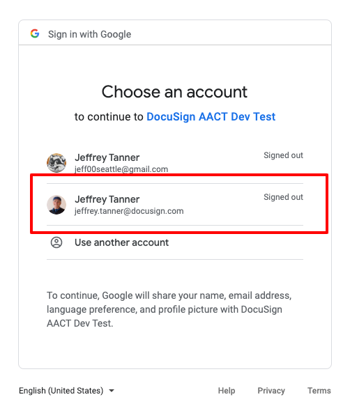
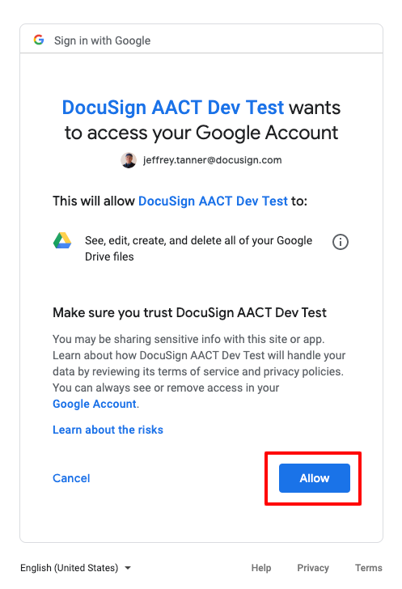
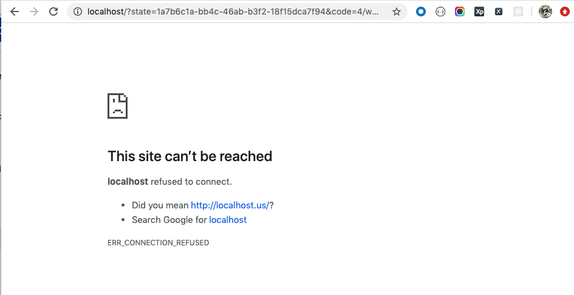

# @act/act-archive-google-drive
##### Google Drive: OAuth 2.0 Bash Scripts

---


---

## MacOS Setup

Setup is required within MacOS environment:
+ Upgrade bash
+ Add command-line utilities

[README_BREW_SETUP_MACOS.md](README_BREW_SETUP_MACOS.md)

## OAuth 2.0 Authentication

The following is gathering Google `access_token` using bash scripts in folder `scripts/oauth2/`:

```bash
$ tree scripts/oauth2 --dirsfirst -FL 1 | grep -v /$

scripts/oauth2
├── get_config_credentials.sh
├── get_config_credentials_code.sh
├── get_config_credentials_token.sh
├── get_userinfo.sh
├── oauth2_code.sh
├── oauth2_refresh_token.sh
├── oauth2_login.sh
├── oauth2_token.sh
└── oauth2_token_status.sh
```

And provide credential configuration to:

```bash
$ tree scripts/credentials

scripts/credentials
├── config
│   └── credentials.template.json
├── credentials_code_parse.sh
├── credentials_parse.sh
└── credentials_token_parse.sh
```

### 1. Configure `credentials.json` with `[** CLIENT_ID **]` and `[** CLIENT_SECRET **]`

1. Start with: `$ cd scripts/credentials/config/`
1. Create a copy of `credentials.template.json` to `credentials.json`
1. Supply these Google Web App values to `credentials.json`
    + `CLIENT_ID`
    + `CLIENT_SECRET`

```json
{
  "client_id":"[** CLIENT_ID **]",
  "client_secret":"[** CLIENT_SECRET **]",
  ...
}
```

If configured correctly, then it should be parsable:

1. Start with: `cd scripts/oauth2/`
1. Execute: `get_config_credentials.sh`

Example response of parsed `scripts/credentials/config/credentials.json`

```bash
-------------------------

  CLIENT_ID: [** CLIENT_ID **]
  CLIENT_SECRET: [** CLIENT_SECRET **]
  REDIRECT_URI: http://localhost
  AUTH_URL: https://accounts.google.com/o/oauth2/v2/auth
  AUTH_TOKEN_URL: https://www.googleapis.com/oauth2/v4/token
  AUTH_SCOPE: https%3a%2f%2fwww.googleapis.com%2fauth%2fuserinfo.email%20https%3a%2f%2fwww.googleapis.com%2fauth%2fuserinfo.profile%20https%3a%2f%2fwww.googleapis.com%2fauth%2fdrive
  AUTH_TOKEN_INFO_URL: https://www.googleapis.com/oauth2/v2/tokeninfo
  SECURITY_TOKEN: [** SECURITY_TOKEN **]
  DOCUSIGN_ID: [** DOCUSIGN_ID **]

-------------------------
```

### 2. Request `[** AUTHENTICATION_CODE **]`

1. Start with: `cd scripts/oauth2/`
1. Execute: `./oauth2_start.sh --verbose`
    + Uses: `credentials.json`
    + Opens default browser 
    + Accesses Google API endpoint to OAuth 2.0 Authentication Service
1. Example Google URL to begin OAuth 2.0  authenticaiton request:
        ```bash
        https://accounts.google.com/o/oauth2/v2/auth?
        access_type=offline
        &prompt=consent
        &response_type=code
        &client_id=[** CLIENT_ID **]
        &redirect_uri=http://localhost
        &state=[** STATE **]
        &scope=https%3a%2f%2fwww.googleapis.com%2fauth%2fuserinfo.email%20https%3a%2f%2fwww.googleapis.com%2fauth%2fuserinfo.profile%20https%3a%2f%2fwww.googleapis.com%2fauth%2fdrive
        ``` 
1. Default browser opens
1. Google Login should appear
1. Choose Google Account and perform Google Login
    + 
1. Consent Google Web App to Grant Access to User's Account
    + 
1. Browser next opens with `REDIRECT_URI=http://localhost`
1. Copy Browser's Address Bar: `[** REDIRECT_URI RESPONSE **]`
    + 

### 3. Parse `[** REDIRECT_URI RESPONSE **]` to fetch `[** AUTHENTICATION_CODE **]`

**Quickly**, copy response redirect URI in browser's address bar, `[** REDIRECT_URI RESPONSE **]` 
because it contains in query string `[** AUTHENTICATION_CODE **]` that is time-limited to approximately one minute.

Authenticated response `REDIRECT_URI=http://localhost` will contain `[** AUTHENTICATION_CODE **]` within its query string.

1. Start with: `cd scripts/oauth2/`
1. Execute: `./oauth2_code.sh --url "[** REDIRECT URI RESPONSE **]"`
    + This script creates: `credentials_code.json`.
1. Parsed `[** REDIRECT URI RESPONSE **]` query parameters copied to `/scripts/credentials/config/credentials_code.json`
1. `/scripts/credentials/config/credentials_code.json` will contain `[** AUTHENTICATION_CODE **]`
1. With gathered time-limited `[** AUTHENTICATION_CODE **]`, go immediately go to Step 2 to request `[** ACCESS TOKEN **]` and `[** REFRESH TOKEN **]`.

Example requests to parse `[** REDIRECT URI RESPONSE **]`, requires wrapping URL with **double-quotes `"[URL]"`**:

```bash
$ ./oauth2_code.sh --url "[** REDIRECT_URI RESPONSE **]"
```

Example contents `scripts/credentials/config/credentials_code.json`:

```json
{
  "state": "[** STATE **]",
  "code": "[** AUTHENTICATION_CODE **]",
  "scope": "email profile https://www.googleapis.com/auth/userinfo.email https://www.googleapis.com/auth/userinfo.profile https://www.googleapis.com/auth/drive openid",
  "authuser": "1",
  "hd": "docusign.com",
  "prompt": "consent",
  "session_state": "[** SESSION STATE **]"
}
```

If configured correctly, then it should be parsable:

```bash
$ ./get_config_credentials_code.sh

-------------------------

  AUTHENTICATION_CODE: [** AUTHENTICATION_CODE **]
  SCOPE: email profile https://www.googleapis.com/auth/userinfo.email https://www.googleapis.com/auth/userinfo.profile https://www.googleapis.com/auth/drive openid

-------------------------
```

### 3. With `[** AUTHENTICATION_CODE **]`, request new `[** ACCESS_TOKEN **]` and `[** REFRESH_TOKEN **]`

**Quickly**, new gather tokens because `[** AUTHENTICATION_CODE **]` is time-limited to approximately one minute.

1. Start with: `cd scripts/oauth2/`
1. Execute `./oauth2_token.sh --verbose`
    + This script uses: `credentials_code.json`.
1. Success will copy `[** ACCESS_TOKEN **]` and `[** REFRESH_TOKEN **]` to `/scripts/credentials/config/credentials_token.json`

Example bash/curl request:

```bash
$ ./oauth2_token.sh --verbose

curl "https://www.googleapis.com/oauth2/v4/token" \
    --request POST \
    --verbose \
    --write-out 'HTTPSTATUS:%{http_code}' \
    --silent \
    --data 'grant_type=authorization_code' \
    --data-urlencode 'code=[** AUTHENTICATION_CODE **]' \
    --data-urlencode 'client_id=[** CLIENT_ID **]' \
    --data-urlencode 'client_secret=[** CLIENT_SECRET **]' \
    --data-urlencode 'redirect_uri=http://localhost' \
    --data-urlencode 'state=[** STATE **]'
```

Example contents `scripts/credentials/config/credentials_token.json`:

```json
{
  "access_token": "[** ACCESS_TOKEN **]",
  "expires_in": 3599,
  "refresh_token": "[** REFRESH_TOKEN **]",
  "scope": "https://www.googleapis.com/auth/userinfo.email https://www.googleapis.com/auth/userinfo.profile https://www.googleapis.com/auth/drive openid",
  "token_type": "Bearer",
  "id_token": "[** ID_TOKEN **]"
}
```

If configured correctly, then it should be parsable:

1. Start with: `$ cd scripts/oauth2/`
1. Execute: `$ ./get_config_credentials_token.sh`

```bash
  ACCESS_TOKEN: [** ACCESS_TOKEN **]
  TOKEN_TYPE: Bearer
  EXPIRES_IN: 3599
  REFRESH_TOKEN: [** REFRESH_TOKEN **]
  SCOPE: openid https://www.googleapis.com/auth/userinfo.email https://www.googleapis.com/auth/userinfo.profile https://www.googleapis.com/auth/drive
```

### 4. With `[** REFRESH_TOKEN **]`, Refresh `[** ACCESS_TOKEN **]` 

When expired, refresh `access_token`:

1. Start with: `cd scripts/oauth2/`
1. Execute `./oauth2_refresh_token.sh --verbose`
    + This script uses: `credentials_token.json`.
1. Success will copy refreshed `[** ACCESS_TOKEN **]` and initial `[** REFRESH_TOKEN **]` to `/scripts/credentials/config/credentials_token.json`

Example bash/curl request:

```bash
$ ./oauth2_refresh_token.sh --verbose

curl "https://www.googleapis.com/oauth2/v4/token" \
    --request POST \
    --verbose \
    --write-out 'HTTPSTATUS:%{http_code}' \
    --silent \
    --data 'grant_type=refresh_token' \
    --data-urlencode 'client_id=[** CLIENT_ID **]' \
    --data-urlencode 'client_secret=[** CLIENT_SECRET **]' \
    --data-urlencode 'refresh_token=[** REFRESH_TOKEN **]'
```

Example refreshed contents `scripts/credentials/config/credentials_token.json`

```json
{
  "access_token": "[** ACCESS_TOKEN **]",
  "expires_in": 3599,
  "scope": "https://www.googleapis.com/auth/userinfo.email https://www.googleapis.com/auth/userinfo.profile https://www.googleapis.com/auth/drive openid",
  "token_type": "Bearer",
  "id_token": "[** ID_TOKEN **]",
  "refresh_token": "[** REFRESH_TOKEN **]"
}
```

### 5. Test `[** ACCESS_TOKEN **]` by requesting Google User Info

1. Start with: `cd scripts/oauth2/`
1. Execute `./get_userinfo.sh --verbose`
    + This script uses: `credentials_token.json`.

```bash
$ ./get_userinfo.sh --verbose

curl "https://www.googleapis.com/userinfo/v2/me?access_token=[** ACCESS_TOKEN **]" \
  --request GET \
  --verbose \
  --write-out 'HTTPSTATUS:%{http_code}' \
  --silent \
  --connect-timeout 60
```

Example response for Google user info:

```json
{
  "id": "108381471207085069045",
  "email": "jeffrey.tanner@docusign.com",
  "verified_email": true,
  "name": "Jeffrey Tanner",
  "given_name": "Jeffrey",
  "family_name": "Tanner",
  "picture": "https://lh3.googleusercontent.com/a-/AAuE7mDvVuYfXzfwuYZ8wzF4_30LIBTumXOHIm1P-Jx8",
  "locale": "en",
  "hd": "docusign.com"
}
```